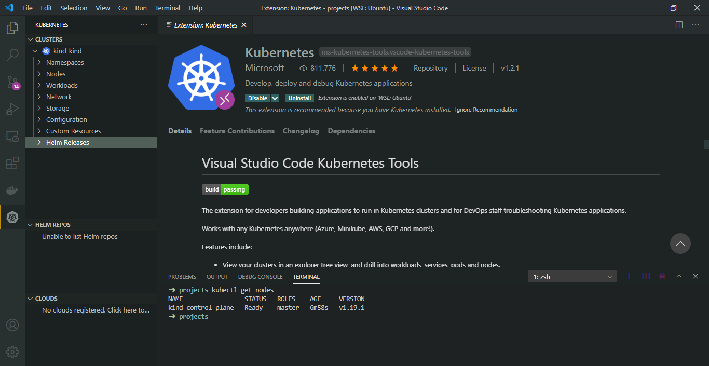
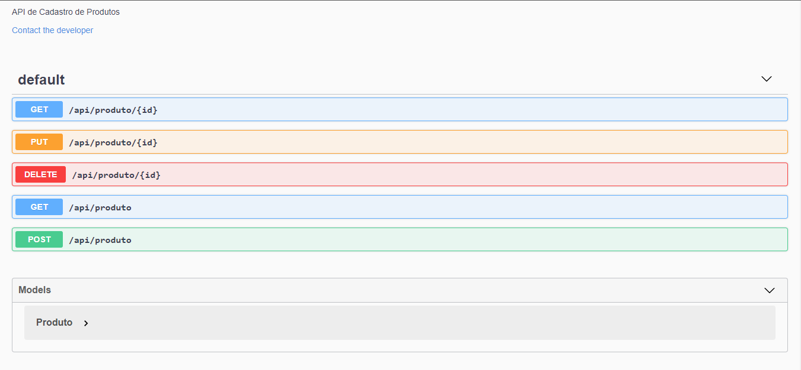

<p align="center"></p>

# 🌱 Project

- Criando um cluster kubernetes localmente utilizando kind

## Docker 
- Instalação do docker
```console
 $ sudo curl -L https://get.docker.com/ | bash
 $ sudo usermod -aG docker $USER
```
## Kind

- Permite criar um cluster kubernetes utilizando containers docker

- Instalação
```console
$ curl -Lo ./kind https://kind.sigs.k8s.io/dl/v0.9.0/kind-linux-amd64
$ chmod +x ./kind
$ sudo mv ./kind /usr/local/bin/
```
# Criando Cluster

## Inicialização do cluster
```console
kind create cluster
```
# Kubectl
## Instalação 
```console
$ curl -LO https://storage.googleapis.com/kubernetes-release/release/`curl -s https://storage.googleapis.com/kubernetes-release/release/stable.txt`/bin/linux/amd64/kubectl

$ chmod +x kubectl

$ sudo mv kubectl /usr/local/bin/
```

## Verificando os nodes
```console
kubectl get nodes
```
```
➜  kubectl get nodes
NAME                 STATUS   ROLES    AGE     VERSION
kind-control-plane   Ready    master   6m58s   v1.19.1
```
## Verificando quantos cluster kubernetes eu tenho

```console
kubectl get clusters
```

## Criando um novo cluster
```console
kubectl create cluster --name meucluster
```

## Coletando informações do cluster

```console
kebectl cluster-info
```

ou
```console
kebectl cluster-info --context kind-meucluster
```

## Deletar o cluster
```console
kind delete cluster
```

# Kubernetes e VSCode

## Instalando extensão



# Nodes

## Arquivo yaml

- Arquivo de configuração para criar vários nodes

```
kind: cluster
apiVersion: kind.x-k8s.io/v1alpha4
nodes:
  - role: control-plane
  - role: worker
  - role: worker
```

## Criando o cluster

```console
kind create cluster --name multinode --config=config.yaml
```


## docker container ls

```
CONTAINER ID        IMAGE                  COMMAND                  CREATED             STATUS              PORTS                       NAMES
17370e2c5b77        kindest/node:v1.19.1   "/usr/local/bin/entr…"   50 minutes ago      Up 8 minutes                                    multinode-worker
288fbb6da5aa        kindest/node:v1.19.1   "/usr/local/bin/entr…"   50 minutes ago      Up 8 minutes        127.0.0.1:35273->6443/tcp   multinode-control-plane
d71c2dff1703        kindest/node:v1.19.1   "/usr/local/bin/entr…"   50 minutes ago      Up 8 minutes                                    multinode-worker2
```

## Deletando o cluster anterior

```console
kind delete cluster --name multinode
```

# Extra Port Mappings

## Ajustando as configurações do Kind

- Adicionando configuração do bind para acessar a api

```
kind: Cluster
apiVersion: kind.x-k8s.io/v1alpha4
nodes:
- role: control-plane
  extraPortMappings:
  - containerPort: 30001
    hostPort: 8080
    listenAddress: "0.0.0.0"
    protocol: TCP  
- role: worker
- role: worker
```

## Criando o cluster

```console
kind create cluster --name multinode --config=config.yaml
```

## docker container ls
```
CONTAINER ID        IMAGE                  COMMAND                  CREATED             STATUS              PORTS                                                NAMES
77185ebe55d2        kindest/node:v1.19.1   "/usr/local/bin/entr…"   4 minutes ago       Up 2 minutes        127.0.0.1:35373->6443/tcp, 0.0.0.0:8080->30001/tcp   multinode-control-plane
6a81f5ea0deb        kindest/node:v1.19.1   "/usr/local/bin/entr…"   4 minutes ago       Up 2 minutes                                                             multinode-worker2
91f1cb9f3d78        kindest/node:v1.19.1   "/usr/local/bin/entr…"   4 minutes ago       Up 2 minutes                                                             multinode-worker
```

- Agora pode-se notar que um dos containes tem um bind para da minha porta 8080 com a 30001 do container.


# Deployment

## Realizando o deploy do serviço

```console
kubectl apply -f ./ -R
```
```
➜  kind kubectl apply -f ./ -R
deployment.apps/api-deployment created
service/api-service created
deployment.apps/mongodb-deployment created
service/mongo-service created
```
- kubectl get all
```
➜  kind kubectl get all
NAME                                      READY   STATUS    RESTARTS   AGE
pod/api-deployment-845798dff5-5d59b       1/1     Running   2          82m
pod/mongodb-deployment-6b7bd66f46-g2nbz   1/1     Running   1          82m

NAME                    TYPE           CLUSTER-IP      EXTERNAL-IP   PORT(S)        AGE
service/api-service     LoadBalancer   10.96.228.90    <pending>     80:30001/TCP   82m
service/kubernetes      ClusterIP      10.96.0.1       <none>        443/TCP        97m
service/mongo-service   ClusterIP      10.96.121.208   <none>        27017/TCP      82m

NAME                                 READY   UP-TO-DATE   AVAILABLE   AGE
deployment.apps/api-deployment       1/1     1            1           82m
deployment.apps/mongodb-deployment   1/1     1            1           82m

NAME                                            DESIRED   CURRENT   READY   AGE
replicaset.apps/api-deployment-845798dff5       1         1         1       82m
replicaset.apps/mongodb-deployment-6b7bd66f46   1         1         1       82m
```

## Acessando a aplicação
```
localhost:8080/api-docs
```



## Referências

- https://kind.sigs.k8s.io/docs/user/quick-start/
- https://kind.sigs.k8s.io/docs/user/configuration/